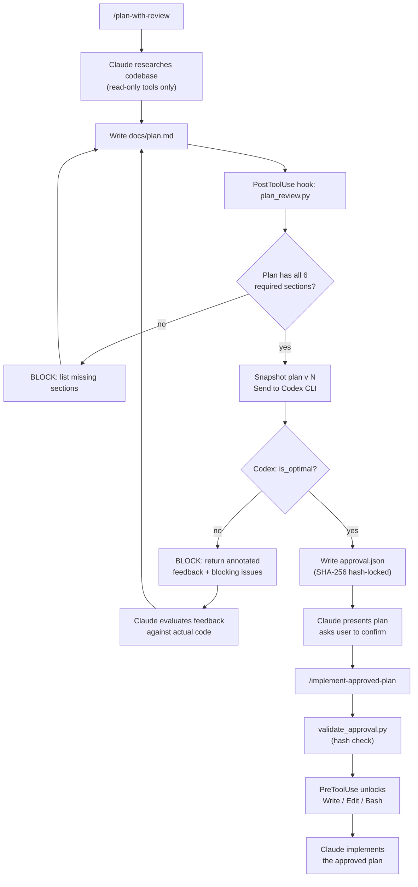

# codex-plan-review (Claude Code plugin)

A Claude Code plugin that enforces a hard **plan → independent review → approval → implementation** workflow:

- Claude writes the plan (`docs/plan.md`)
- OpenAI Codex CLI reviews the plan against the real codebase (schema-constrained output)
- Claude is blocked from editing anything except `docs/plan.md` until the plan is approved
- Once approved, implementation is unlocked (with hash verification)

This repo is also structured as a **plugin marketplace** containing the `codex-plan-review` plugin at `./plugin`.

---

## Why this exists

The biggest risk with autonomous coding agents isn't that they can't write code — it's that **an agent grading its own homework compounds errors instead of catching them.**

LLM coding agents are fast, but without independent review they frequently:

- **Hallucinate APIs** — reference functions, modules, or integration patterns that don't exist in the codebase
- **Skip straight to implementation** — start writing code before risks, edge cases, or architectural conflicts are surfaced
- **Self-confirm** — when the same model that wrote the plan also reviews it, self-review bias means plausible-sounding mistakes survive unchallenged

There is no built-in quality gate between "plan written" and "plan executed." This plugin adds one — and enforces it at the hook level so it can't be bypassed.

### Why two models?

This architecture splits two fundamentally different jobs — **creation** and **verification** — across two independent models, so neither is grading its own work.

```
┌─────────────────────────────┐               ┌─────────────────────────────┐
│     CLAUDE (Planner)        │   docs/       │     CODEX (Verifier)        │
│                             │   plan.md     │                             │
│  • Researches the codebase  │ ────────────▶ │  • Evaluates every claim    │
│  • Writes structured plan   │               │    against actual code      │
│  • Revises based on         │ ◀──────────── │  • Returns structured JSON  │
│    annotated feedback       │   Annotated   │    with blocking issues     │
│                             │   feedback    │  • Uses MCP for deep        │
│                             │               │    codebase introspection   │
└─────────────────────────────┘               └─────────────────────────────┘
```

**Claude produces the plan.** It excels at synthesizing requirements into structured, human-readable implementation plans — researching the codebase with read-only tools and organizing findings into a 6-section format (Goal, Context, Approach, Changes, Risks, Open Questions).

**Codex verifies the plan.** Running headless via `codex exec`, Codex acts as a strict auditor confined to a JSON output schema. It can't "go off script" — it must return structured `blocking_issues` with evidence and fixes, or approve the plan as optimal. It uses available MCP servers for deep codebase access.

**The handoff is artifact-based, not conversational.** The plan file, approval record, and review artifacts are deterministic files on disk. Claude and Codex never share a conversation — they share a filesystem. This makes the workflow reproducible, auditable, and impossible to subvert through prompt manipulation.

---

## Key features

- **Automatic plan review** every time `docs/plan.md` is written or edited
- **Structured review output** (JSON Schema) so approval is machine-checkable, not just prose
- **Hash-locked approval** — SHA-256 of the exact plan content; any change invalidates it
- **Planning-stage lockdown**
  - Only `docs/plan.md` can be edited
  - Bash restricted to a read-only allowlist (`ls`, `rg`, `git diff`, `cat`, etc.)
  - Drift check blocks unexpected file modifications after Bash commands
- **Persistent Codex sessions** — thread ID stored for resume across revision rounds
- **Full audit trail** in `.claude/review/` — per-revision snapshots, Codex JSON outputs, annotated plans with inline feedback
- **Worktree bootstrap** script to isolate the workflow from your main working tree

---

## How it works



**Step by step:**

1. **Planning** — You run `/plan-with-review`. Claude researches the codebase using read-only tools and writes a 6-section plan to `docs/plan.md`.
2. **Interception** — A `PostToolUse` hook detects the write to `docs/plan.md`, validates plan structure, and snapshots the plan.
3. **Review** — The hook sends the plan to Codex CLI. Codex evaluates every claim against the actual code and returns structured JSON feedback.
4. **Rejection loop** — If Codex finds issues, the hook blocks Claude with annotated feedback. Claude reads the feedback, evaluates each issue against the code, revises the plan, and re-triggers review. This repeats up to 5 times.
5. **Approval** — When Codex approves, the hook writes `approval.json` containing the plan's SHA-256 hash. Claude presents the final plan and asks you to confirm.
6. **Implementation** — You run `/implement-approved-plan`. The `PreToolUse` hook verifies the hash and unlocks Write, Edit, and Bash. Claude implements the plan.

**The two phases:**

| | Planning Phase | Implementation Phase |
|---|---|---|
| **Write/Edit** | Only `docs/plan.md` | Unrestricted |
| **Bash** | Read-only allowlist only | Unrestricted |
| **Triggered by** | `/plan-with-review` | `/implement-approved-plan` |
| **Gated by** | Plan structure validation + Codex review | `approval.json` hash match |

---

## Prerequisites

| Tool | Purpose | Install |
|------|---------|---------|
| [Claude Code](https://docs.anthropic.com/en/docs/claude-code) | AI coding agent (plugin host) | `npm install -g @anthropic-ai/claude-code` |
| [Codex CLI](https://github.com/openai/codex) | Independent plan reviewer | `npm install -g @openai/codex` |
| Python 3 | Hook scripts runtime | Pre-installed on macOS/Linux |
| Git | Version control, drift detection | Pre-installed on macOS/Linux |

Verify your setup:

```bash
claude --version    # Claude Code CLI
codex --version     # Codex CLI
python3 --version   # Python 3
git --version       # Git
```

**Note:** Codex MCP configuration (`.codex/config.toml`) is user-managed. The plugin does not configure Codex's MCP servers — you must ensure Codex has the access it needs to review your codebase effectively.

## Installation

### Option A: Marketplace (recommended)

```bash
/plugin marketplace add <repo-url>
/plugin install codex-plan-review@codex-plan-review
```

### Option B: Direct plugin loading

```bash
claude --plugin-dir ./plugin
```

### Option C: Bootstrap with worktree

Creates an isolated git worktree and launches Claude Code with the plugin loaded:

```bash
./plugin/bootstrap.sh [base-branch]
```

Example output:

```
Creating worktree at /repo/.worktrees/plan-review-20250222-143000 from main...
Worktree created!
  Worktree: /repo/.worktrees/plan-review-20250222-143000
  Branch:   plan-review/20250222-143000

Skills available:
  /codex-plan-review:plan-with-review         — Create a Codex-reviewed plan
  /codex-plan-review:implement-approved-plan  — Implement an approved plan

Launching Claude Code...
```

## Usage

Once Claude Code is running with the plugin, there are two skills:

### Plan with Review

Three ways to invoke:

```bash
# From a strategy document (default: docs/strategy.md)
/codex-plan-review:plan-with-review

# From a specific file
/codex-plan-review:plan-with-review path/to/strategy.md

# From a free-text description
/codex-plan-review:plan-with-review add authentication to the API
```

What happens:

1. Claude reads the input (file or text) and researches the codebase using read-only tools
2. If there are open questions, Claude asks you before writing the plan
3. Claude writes `docs/plan.md` with all 6 required sections
4. The PostToolUse hook automatically snapshots the plan and sends it to Codex
5. If rejected — Claude reads Codex's annotated feedback, evaluates each issue against the code, and revises (re-triggering review automatically)
6. The loop repeats (up to 5 revisions) until Codex approves
7. On approval — Claude presents the plan and asks: *"Ready to execute?"*

### Implement Approved Plan

```bash
/codex-plan-review:implement-approved-plan
```

What happens:

1. Runs `validate_approval.py` to confirm `approval.json` is valid and hash matches
2. Reads `docs/plan.md` for the approved approach and file-level changes
3. Implements the plan systematically, one file/component at a time

**Tip:** Use `/clear` between planning and implementation to free up context window. The implementation skill works entirely from artifacts (`docs/plan.md` and `approval.json`) — it does not depend on the planning session.

---

## Plan Structure

`docs/plan.md` must contain these 6 sections. The PostToolUse hook rejects the plan if any are missing.

| Section | Purpose |
|---------|---------|
| `## Goal` | What this plan achieves. One paragraph. |
| `## Context` | Relevant codebase context. Reference specific files and patterns. |
| `## Approach` | High-level architectural approach. Why this over alternatives. |
| `## Changes` | File-level detail: what changes, new files, affected dependencies. |
| `## Risks` | What could go wrong. Mitigation strategies. |
| `## Open Questions` | Unresolved questions needing user input. |

---

## Architecture

### Plugin Directory

```
plugin/
├── .claude-plugin/
│   └── plugin.json                 # Plugin manifest (name, version, description)
├── bootstrap.sh                    # Worktree creation + Claude Code launch
├── hooks/
│   ├── hooks.json                  # Hook configuration (matchers, timeouts)
│   ├── enforce_approval.py         # PreToolUse: gate writes until approved
│   ├── plan_review.py              # PostToolUse: Codex review on plan writes
│   ├── bash_drift_check.py         # PostToolUse: detect unexpected file changes
│   ├── validate_approval.py        # Standalone approval validation script
│   └── codex_review_schema.json    # Codex structured output schema
├── skills/
│   ├── plan-with-review/
│   │   └── SKILL.md                # Planning workflow skill definition
│   └── implement-approved-plan/
│       └── SKILL.md                # Implementation workflow skill definition
└── tests/
    ├── test_enforce_approval.py
    ├── test_plan_review.py
    ├── test_validate_approval.py
    └── test_bash_drift_check.py
```

### Hook System

| Hook | Type | Matcher | Timeout | Purpose |
|------|------|---------|---------|---------|
| `enforce_approval.py` | PreToolUse | `Write\|Edit\|Bash` | 10s | Gate all writes and dangerous commands until plan is approved |
| `plan_review.py` | PostToolUse | `Write\|Edit` | 600s | Trigger Codex review when `docs/plan.md` is written |
| `bash_drift_check.py` | PostToolUse | `Bash` | 30s | Detect unexpected file changes after Bash commands |

### Hook Details

**`enforce_approval.py` (PreToolUse)**

The enforcement gate. Runs before every Write, Edit, and Bash tool use.

- **Write/Edit to `docs/plan.md`**: Always allowed (Claude needs to write the plan)
- **Write/Edit to `.claude/review/`**: Always denied (hook-managed directory)
- **Write/Edit to any other file**: Denied unless `approval.json` exists with valid hash
- **Bash commands before approval**: Only read-only commands allowed. The hook maintains:
  - An allowlist of safe commands (`rg`, `grep`, `ls`, `cat`, `head`, `tail`, `wc`, `file`, `fd`, `tree`, `which`, `echo`, `pwd`, `date`, `env`, `printenv`)
  - Read-only git subcommands (`status`, `diff`, `show`, `log`, `rev-parse`, `grep`, `branch`, `remote`, `tag`, `describe`, `shortlog`, `stash`, `ls-files`, `ls-tree`, `cat-file`)
  - A blocklist of dangerous commands (`python`, `python3`, `node`, `bash`, `sh`, `sed`, `awk`, `npm`, `npx`, `yarn`, `rm`, `mv`, `cp`, `mkdir`, `curl`, `wget`, `docker`, `make`, and others)
  - Shell operator detection (`|`, `;`, `&&`, `||`, `>`, `>>`, `<`, `$(`, `` ` ``)
  - Special exception: `python3 validate_approval.py` is allowed (needed by the implementation skill)
- **After approval**: Everything is allowed

**`plan_review.py` (PostToolUse)**

The review engine. Triggers after any Write/Edit to `docs/plan.md`.

1. Invalidates any previous approval (deletes `approval.json`, thread ID, all versioned artifacts, resets counter)
2. Validates plan structure (checks for all 6 required section headings)
3. Increments version counter and snapshots the plan
4. Checks max revision threshold (default: 5); blocks if exceeded
5. Builds a review prompt and sends the plan to Codex CLI (`codex exec --json`)
6. Manages persistent Codex sessions (stores thread ID for resume across revisions)
7. On approval: writes `approval.json` with SHA-256 hash of the plan
8. On rejection: returns blocking issues and path to annotated feedback

**`bash_drift_check.py` (PostToolUse)**

Runs after every Bash command during the planning phase. Checks `git status --porcelain` for file changes outside `docs/plan.md` and `.claude/review/`. If unexpected changes are detected, blocks with a list of affected files. Skips entirely if a valid approval exists (implementation phase).

---

## Runtime Artifacts

All review artifacts are stored in `.claude/review/` (created at runtime, gitignored):

| File | Description |
|------|-------------|
| `plan_v{N}.snapshot.md` | Frozen copy of the plan before review round N |
| `plan_v{N}.codex.json` | Codex's structured JSON output for round N |
| `plan_v{N}.annotated.md` | Codex's annotated plan with inline comments for round N |
| `approval.json` | Approval record (written when Codex approves) |
| `version_counter` | Current revision number (plain text integer) |
| `codex_thread_id` | Persistent Codex session ID for resume |

### `approval.json` Structure

```json
{
  "is_optimal": true,
  "plan_hash": "sha256-hex-digest-of-docs/plan.md",
  "review_version": 3,
  "approved_at": "2025-02-22T14:30:00+00:00",
  "codex_thread_id": "thread_abc123"
}
```

**Hash sensitivity:** The `plan_hash` is a SHA-256 of the raw bytes of `docs/plan.md`. Any modification after approval — even whitespace changes — invalidates the hash and blocks implementation until the plan is re-reviewed.

---

## Codex Review Schema

Codex returns structured JSON conforming to `codex_review_schema.json`:

```json
{
  "is_optimal": false,
  "blocking_issues": [
    {
      "severity": "high",
      "claim": "Plan references a UserService.authenticate() method",
      "evidence": "UserService has no authenticate() method; auth is handled by AuthMiddleware",
      "fix": "Replace UserService.authenticate() references with AuthMiddleware.verify()"
    }
  ],
  "recommended_changes": [
    "Consider using the existing RateLimiter instead of implementing a new one"
  ],
  "annotated_plan_markdown": "## Goal\n...\n> [CODEX] This claim is inaccurate...",
  "summary": "Plan contains 1 high-severity inaccuracy in the auth approach"
}
```

| Field | Type | Description |
|-------|------|-------------|
| `is_optimal` | `boolean` | `true` only if the plan is solid, accurate, and optimal |
| `blocking_issues` | `array` | Issues that must be fixed. Each has `severity` (high/medium/low), `claim`, `evidence`, and `fix` |
| `recommended_changes` | `array of string` | Non-blocking suggestions for improvement |
| `annotated_plan_markdown` | `string` | The full plan with Codex's inline comments as blockquotes |
| `summary` | `string` | One-line summary of the review result |

---

## Troubleshooting

### "Codex CLI not found"

The `codex` command is not on your PATH.

```bash
npm install -g @openai/codex
codex --version  # Verify installation
```

### "Missing required sections"

Your `docs/plan.md` is missing one or more of the 6 required headings. The error message lists which ones. Ensure your plan contains exactly:

```markdown
## Goal
## Context
## Approach
## Changes
## Risks
## Open Questions
```

### "Maximum revision threshold reached"

The plan has been revised 5 times without Codex approval. The hook will not allow further revisions. You have two options:

1. **Review the impasse** — read the latest annotated feedback in `.claude/review/` and decide if the remaining issues matter
2. **Force-approve manually** — create `approval.json` with the correct hash:

```bash
python3 -c "
import hashlib, json
with open('docs/plan.md', 'rb') as f:
    h = hashlib.sha256(f.read()).hexdigest()
json.dump({'is_optimal': True, 'plan_hash': h, 'review_version': 0, 'approved_at': '', 'codex_thread_id': ''}, open('.claude/review/approval.json', 'w'), indent=2)
print('Force-approved with hash:', h)
"
```

### "Cannot write to files other than docs/plan.md"

The enforcement hook is blocking writes because no valid approval exists. Either:

- Complete the plan review process (`/plan-with-review`)
- Or force-approve as described above

### "Plan modified since approval"

`docs/plan.md` changed after Codex approved it (SHA-256 hash no longer matches). Re-run the review:

```bash
/codex-plan-review:plan-with-review
```

### "Codex CLI timed out"

The Codex review exceeded the 540-second subprocess timeout. This can happen with very large plans or Codex server issues. Options:

- Re-trigger the review by writing the plan again
- Simplify the plan (split into smaller plans)
- Force-approve if you're confident in the plan

### "Unexpected file changes detected"

The bash drift check found files modified outside `docs/plan.md` and `.claude/review/` during the planning phase. This usually means a Bash command had unintended side effects. Revert the unexpected changes or investigate what caused them.

---

## OpenSpec Integration

This project uses [OpenSpec](https://github.com/openspec) for specification management. The `openspec/` directory contains WHEN/THEN specifications that formally describe the plugin's behavior.

### Spec Directory

```
openspec/
└── specs/
    ├── plan-review-hook/         # Core hook behavior
    ├── codex-review-schema/      # Review output format
    ├── approval-validation-cli/  # Approval validation
    ├── artifact-snapshots/       # Plan snapshotting
    ├── codex-session-manager/    # Codex thread persistence
    ├── implement-skill/          # Implementation skill
    ├── plan-skill/               # Planning skill
    ├── plugin-bootstrap/         # Worktree bootstrap
    ├── plugin-manifest/          # Plugin manifest format
    ├── plugin-marketplace/       # Marketplace integration
    ├── plugin-skills-format/     # Skill file format
    └── worktree-bootstrap/       # Worktree creation
```

### Sample Spec

From `plan-review-hook/spec.md`:

```markdown
#### Scenario: Missing headings block review
- **WHEN** `docs/plan.md` is missing `## Risks` and `## Open Questions`
- **THEN** the hook returns `decision: "block"` with reason
  "Missing required sections: ## Risks, ## Open Questions"

#### Scenario: User force-approves after impasse
- **WHEN** the user manually writes `approval.json` with correct
  `plan_hash` and `is_optimal: true`
- **THEN** the PreToolUse gate allows implementation to proceed
```

### OpenSpec Commands

| Command | Description |
|---------|-------------|
| `/opsx:explore` | Enter explore mode — think through ideas, investigate problems, clarify requirements |
| `/opsx:new` | Start a new change using the artifact-driven workflow |
| `/opsx:ff` | Fast-forward — create a change and generate all artifacts in one go |
| `/opsx:apply` | Implement tasks from an OpenSpec change |
| `/opsx:continue` | Continue working on a change — create the next artifact |
| `/opsx:verify` | Verify implementation matches change artifacts before archiving |
| `/opsx:sync` | Sync delta specs from a change to main specs |
| `/opsx:archive` | Archive a completed change |
| `/opsx:bulk-archive` | Archive multiple completed changes at once |
| `/opsx:onboard` | Guided onboarding — walk through a complete OpenSpec workflow cycle |

---

## Contributing

### Dev Setup

```bash
git clone <repo-url>
cd codex-review
claude --plugin-dir ./plugin    # Load the plugin for development
```

### Making Changes

This project uses its own review workflow:

1. Run `/codex-plan-review:plan-with-review` with your proposed change
2. Iterate through the review loop until Codex approves
3. Run `/codex-plan-review:implement-approved-plan` to implement

### Testing Hooks Manually

Each hook reads JSON from stdin. You can test them directly:

```bash
# Test enforce_approval.py — should deny (no approval exists)
echo '{"tool_name":"Write","tool_input":{"file_path":"src/main.py"},"cwd":"/your/repo"}' \
  | python3 plugin/hooks/enforce_approval.py

# Test enforce_approval.py — should allow (plan.md is always writable)
echo '{"tool_name":"Write","tool_input":{"file_path":"docs/plan.md"},"cwd":"/your/repo"}' \
  | python3 plugin/hooks/enforce_approval.py

# Test enforce_approval.py — should allow (read-only Bash command)
echo '{"tool_name":"Bash","tool_input":{"command":"git status"},"cwd":"/your/repo"}' \
  | python3 plugin/hooks/enforce_approval.py

# Test enforce_approval.py — should deny (write command before approval)
echo '{"tool_name":"Bash","tool_input":{"command":"npm install"},"cwd":"/your/repo"}' \
  | python3 plugin/hooks/enforce_approval.py

# Test bash_drift_check.py — checks git status for unexpected changes
echo '{"tool_name":"Bash","tool_input":{"command":"ls"},"cwd":"/your/repo"}' \
  | python3 plugin/hooks/bash_drift_check.py
```

### Running Tests

```bash
python3 -m pytest plugin/tests/ -v
```

### Code Style

- Hook scripts are standalone Python 3 with no external dependencies
- All hooks communicate via JSON on stdin/stdout
- Hooks exit 0 in all cases (errors are communicated via JSON output, not exit codes)

---

## Project Structure

```
codex-review/
├── README.md                       # This file
├── plugin/                         # Claude Code plugin
│   ├── .claude-plugin/
│   │   └── plugin.json             # Plugin manifest
│   ├── README.md                   # Plugin-specific documentation
│   ├── bootstrap.sh                # Worktree + launch script
│   ├── hooks/                      # Hook scripts
│   │   ├── hooks.json              # Hook configuration
│   │   ├── enforce_approval.py     # PreToolUse enforcement gate
│   │   ├── plan_review.py          # PostToolUse Codex review
│   │   ├── bash_drift_check.py     # PostToolUse drift detection
│   │   ├── validate_approval.py    # Standalone approval validator
│   │   └── codex_review_schema.json
│   ├── skills/                     # Skill definitions
│   │   ├── plan-with-review/
│   │   └── implement-approved-plan/
│   └── tests/                      # Hook unit tests
├── openspec/                       # Specifications (OpenSpec format)
│   └── specs/                      # WHEN/THEN behavioral specs
├── docs/                           # Runtime artifacts (gitignored)
│   └── plan.md                     # Generated plan (created at runtime)
└── .claude-plugin/
    └── marketplace.json            # Marketplace registration
```
